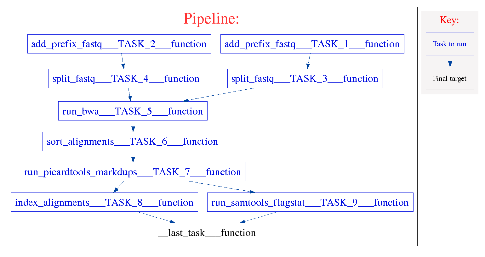

=======================
bwa_alignment workflow 
=======================
.. topic:: Development information

    * Date Created : Mar 11 2014
    * Last Update  : May 1 2015
    * Developer    : Diljot Grewal (dgrewal@bccrc.ca)

.. here you can add the workflow plot

    
This workflow:

* accepts a pair of fastq files as input and aligns them using the Burrows-Wheeler Aligner
* sorts the aligned bam files, flags the duplicates, index the bam file and generates stats about the final bam file 

using the following steps:

1. add prefix to the read names in the fastq file. This can help guarantee unique readnames. These tasks can be switched off based on the input fastq files (add_prefix_TASK_1/_2)
2. split the fastq files into smaller chunks for parallelization (split_fastq_TASK_3/_4)
#. align the fastq files with bwa aligner (run_bwa_TASK_5)
#. sort the aligned bam file based on coordinates (sort_alignments_TASK_6)
#. flag the duplicate reads. This task can be switched off (run_picardtools_markdups_TASK_7)
#. generate the index for the bam file (index_alignments_TASK_8)
#. generate the flagstat information (run_samtools_flagstat_TASK_9)

Components
==========
* *component 1*: 

 * component_name: `add_prefix_fastq <https://github.com/MO-BCCRC/add_prefix_fastq>`_
 * component_version: '1.1.6'
 * seed_version: '1.0.1'
 
* *component 2*:

 * component_name: `split_fastq <https://github.com/MO-BCCRC/split_fastq>`_
 * component_version: '1.1.3'
 * seed_version: '1.0.4'
    
* *component 3*:

 * component_name: `run_bwa <https://github.com/MO-BCCRC/run_bwa>`_
 * component_version: '1.0.4'
 * seed_version: '1.0.0' 

* *component 4*:
 
 * component_name: `run_samtools_sort <https://github.com/MO-BCCRC/run_samtools_sort>`_
 * component_version: '1.0.0'
 * seed_version: '0.1.19'
 
* *component 5*:

 * component_name: `run_picardtools_markdups <https://github.com/MO-BCCRC/run_picardtools_markdups>`_
 * component_version: '1.0.0'
 * seed_version: '1.71'

* *component 6*:

 * component_name: `run_samtools_index <https://github.com/MO-BCCRC/run_samtools_index>`_
 * component_version: '1.0.0'
 * seed_version: '0.1.19'
  
* *component 7*:

 * component_name: `run_samtools_flagstat <https://github.com/MO-BCCRC/run_samtools_flagstat>`_
 * component_version: '1.0.0'
 * seed_version: '0.1.19'
 
* *component 8*:

 * component_name: `remove_files <https://github.com/MO-BCCRC/remove_files>`_
 * component_version: '1.0.0'
 * seed_version: '1.0.0'
  
Requirements
============
* Kronos >=v2.0.4
* Python >= v2.7.6
* Java >= 1.7.0
* Samtools >=0.1.18
* BWA >= 0.7.5a
* Picardtools >= 1.71

How to run the workflow
=======================  
**Step 1.** Update the ``setup.txt`` file provided with the workflow by passing proper paths/values to the *value* column.

.. note::

    This file is a tab separated file and the first line, *i.e.* '``#section key value``', is part of the file.
    
**Step 2.** Update the ``input.txt`` file with proper paths/values.

.. note::

    This file is a tab separated file and the first line, *i.e.* '``#sample_id ...``', is part of the file.
    Sample ID's are arbitrary.
    However, they cannot be used more than once in an input file.
      
**Step 3.** Run the workflow using the following command:

.. code:: bash
 
     kronos run -c <path/to/components_dir/ -e <a name for workflow> 
                -i <input.txt> -r <run_id> -s <setup.txt>  
                -w <workind_dir> -y <path/to/config.yaml>

Please note to replace ``<.>`` with the actual values.
See kronos online documentation for more information on the `run <http://kronos.readthedocs.org/en/latest/launch_pipeline/run.html#how-to-run-pipeline>`_ command.

Outputs
=======
The resulting files will be saved in the <working_dir>/<run_id> directory.
For this workflow, the final result files are:

* bam files
* flagstats
  
Please refer to the Kronos online documentation for more information on the structure of the `results directory <http://kronos.readthedocs.org/en/latest/launch_pipeline/run.html#results-generated-by-a-pipeline>`_.

Changelog
=========
* v2.5: added support for the new shahlab cluster
* v2.4: bug fixes, files were being deleted earlier than they should have been
* v2.3: added cleanup option to the pipeline which removes the intermediate files.
  The pipeline will not rerun from the last checkpoint with this option enabled.

